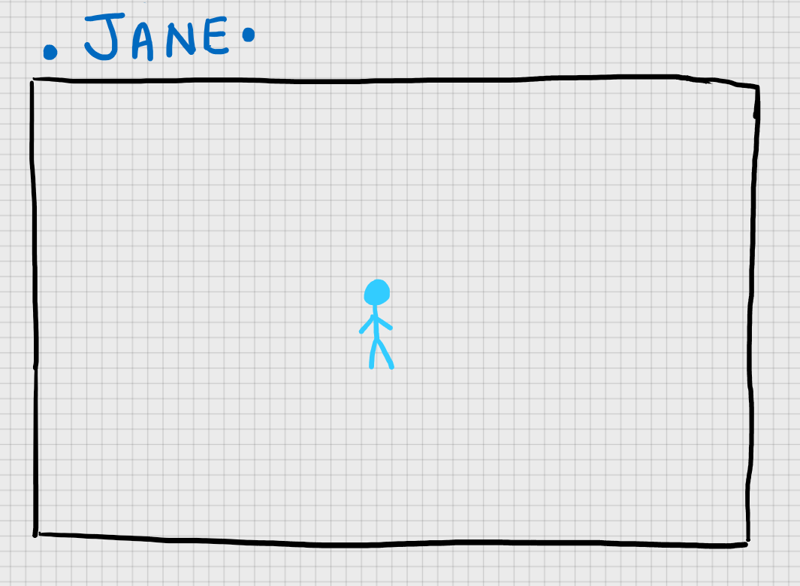

# project-simulation
Made for hacktoberfest, providing a chance for everyone to experience contributing but without really making the code.

## What?
The simulated project will be a game named "JANE".

Meet JANE, the blue stickwoman, living in this box world. Soon her world will be filled with many interesting features and things by us humans.

## Installation
1. Install a photo viewer of your choice.
2. Save the image above.
3. Jane is now in your machine :D.

## Want to contribute?
Refer to [CONTRIBUTING.md](./CONTRIBUTING.md) for more detailed instruction. Reading the contributing.md beforehand is the usual flow before contributing to an open-source project. 

## Extra
[Learn how to make your own open-source project](https://opensource.guide/starting-a-project/)
